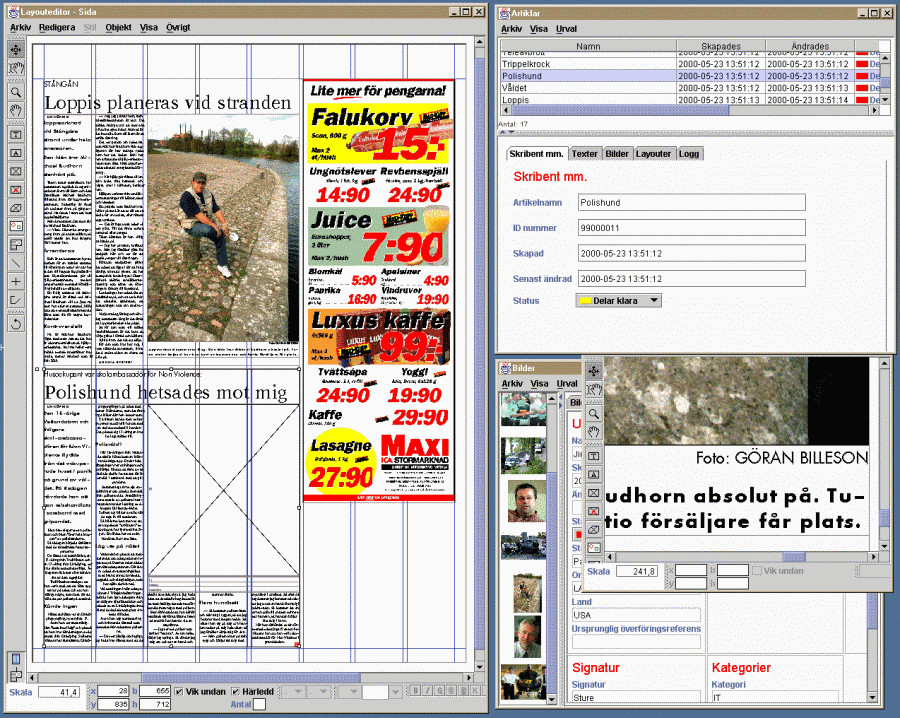

// Badges
image:http://img.shields.io/travis/goranstack/bluebrim/master.svg["Build Status (Travis CI)", link="https://travis-ci.org/goranstack/bluebrim"]

= LayoutEditor
A Java Swing application for page layout. 

== Background
The editor was originally part of project owned by a Swedish company called BlueBrim AB. The goal of the project was to develop a complete prepress system including modules for editorial, advertising, subscription and distribution.

The LayoutEditor was designed to be a module in this client server system using GemStone J for persistence and distribution of objects between server and clients.

== Features

* QuarkXPress look alike user interface
* Tools for creating various page items: Text, Image, Line, Orthogonal Line, Layout Area
* All Page Items have shape, stroke and fill
* Special page item capable of projecting a tagged text and images in a layout
* PostScript output
* Include EPS files in the layout.
* Kerning, tracking and pair kerning

